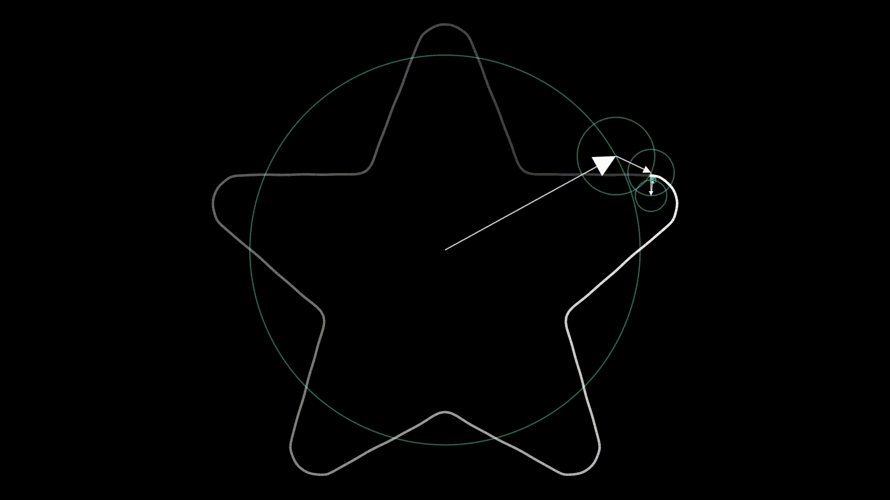
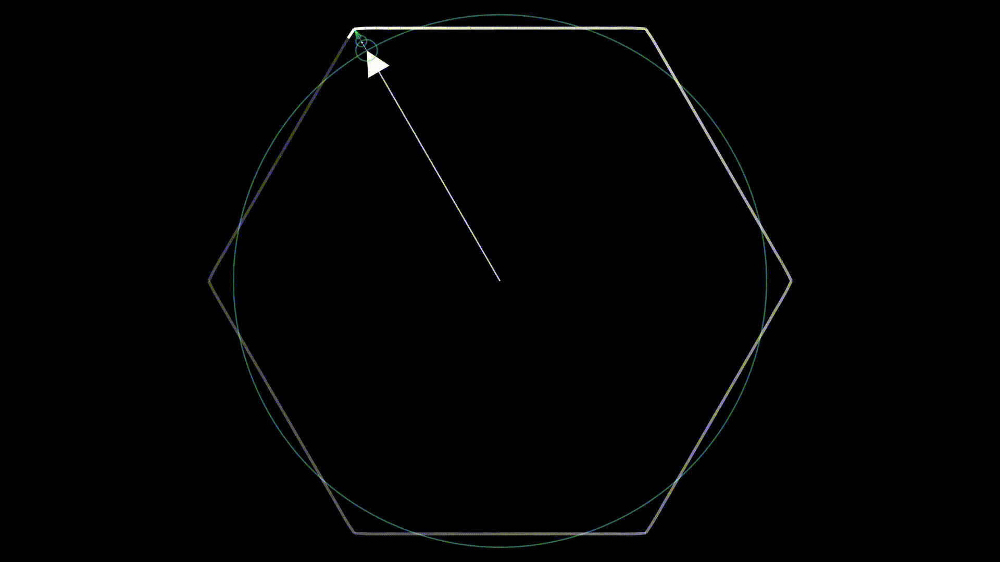

# Fourier Transform (Epicycles)
Transform an image or a polygon into a series of rotating circles.  
This project is written from scratch and it looks like a spin off from the videos because that was the aim, not because the code was copied (trust me if I could have, it would have saved me a ton of effort).  
Inspired by [this video](https://www.youtube.com/watch?v=-qgreAUpPwM) and a challenge from a friend.
## Maths
See details of the maths explained in [this video](https://www.youtube.com/watch?v=r6sGWTCMz2k&t=853s).

## Examples
### Images
#### Handshake

#### Skyline

#### Bird

### SVG Files
#### Pi Creature

#### GitHub Logo

#### Heart

#### Star

### Polygons
#### Traingle

#### Hexagon

### Text
#### Letter G


## Installation
Requires `python >= 3.10`  
The rendering uses [Manim Community](https://github.com/manimCommunity/manim) (the community version of the software in the [3Blue1Brown videos](https://www.youtube.com/c/3blue1brown) but you **don't** need to install $\LaTeX$.

```
pip install -r requirements.txt
```

## Usage
Transform an image (.svg) or a polygon into a series of rotating circles

```
usage: main.py [-h] [-o OUTPUT] [-p] [-n NUMBER] [-r ROTATIONS] [-d DURATION] [-f FADE] {vector,image,polygon} ...

Transform an image or a polygon into a series of rotating circles

options:
  -h, --help            show this help message and exit

Input Options:
  Select different input formats

  {vector,image,polygon}
    vector              transform an SVG file
    image               transform an image file
    polygon             transform a polygon

Output Options:
  -o OUTPUT, --output OUTPUT, --output_file OUTPUT
                        output file (default: output.mp4)
  -p, --preview         preview when complete

Animation Options:
  -n NUMBER, --number NUMBER
                        number of circles (default: 50)
  -r ROTATIONS, --rotations ROTATIONS
                        number of complete rotations (default: 3)
  -d DURATION, --duration DURATION
                        number of seconds for each rotation (default: 10)
  -f FADE, --fade FADE  rate of exponential decay of path - higher means faster decay (default: 0.005)
```
### Images
```
usage: main.py image [-h] [-i IMAGE]

image

options:
  -h, --help            show this help message and exit
  -i IMAGE, --image IMAGE
                        image file
```
### Vector Graphics
```
usage: main.py vector [-h] [-v VECTOR]

vector

options:
  -h, --help            show this help message and exit
  -v VECTOR, --vector VECTOR
                        SVG file
```
### Polygon
```
usage: main.py polygon [-h] [-s SIDES]

polygon

options:
  -h, --help            show this help message and exit
  -s SIDES, --sides SIDES
                        number of sides
```
